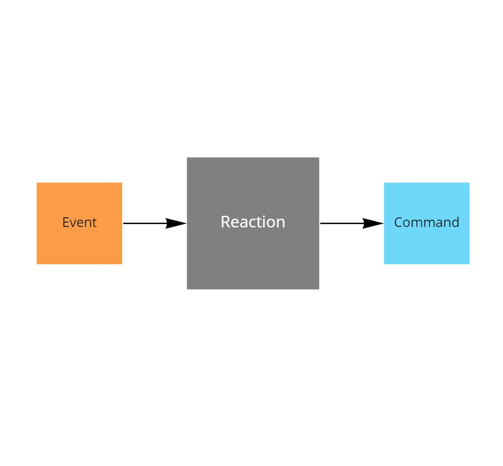

# Implementing a reaction

This project is part of the [MessageHandler processing patterns](https://www.messagehandler.net/patterns/) library.

MessageHandler is distributed under a commercial license, for more information on the terms and conditions refer to [our license page](https://www.messagehandler.net/license/).

## What is a reaction

A reaction responds to an occurance of an event by invoking a command.



## When to use it

Use this pattern every time something needs to happen in reaction to something else that happened before.

## What you need to get started

- The [.NET 6 SDK](https://dotnet.microsoft.com/en-us/download) should be installed
- The sample was created using [Visual Studio 2022 community edition](https://visualstudio.microsoft.com/vs/).
- To receive events an [azure service bus namespace](https://docs.microsoft.com/en-us/azure/service-bus-messaging/service-bus-create-namespace-portal) is used.
- The **MessageHandler.Runtime.AtomicProcessing** package is available from [nuget.org](https://www.nuget.org/packages/MessageHandler.Runtime.AtomicProcessing/)

## Running the sample

Prior to being able to run the sample, you need to [configure the user secrets file](https://docs.microsoft.com/en-us/aspnet/core/security/app-secrets?view=aspnetcore-6.0&tabs=windows#manage-user-secrets-with-visual-studio).

In the secrets file you must specify the following configuration values.

```JSON
{
  "servicebusnamespace": "your azure service bus connection string goes here"
}
```

Also ensure a topic named `orderbooking.events`, with a subscription named `orderbooking.worker` is created up front in the service bus namespace.

Once configured you can start the worker or run the unittests.

## Designed with testing in mind

MessageHandler is intented to be test friendly.

This sample contains plenty of ideas on how to test a reaction without requiring a dependency on an actual broker instance, and thus keep the tests fast.

- [Component tests](https://github.com/MessageHandler/MessageHandler.Quickstarts.Reaction/tree/master/src/Tests/ComponentTests): To test the reaction logic and it's interaction with the email service.
- [Contract tests](https://github.com/MessageHandler/MessageHandler.Quickstarts.Reaction/tree/master/src/Tests/ContractTests): To verify that the test doubles used in the component tests are behaving the same as an actual dependency would. Note: contract verification files are often shared between producers and consumers of the contract.

## How to implement it yourself

Check out [this how to guide](https://www.messagehandler.net/docs/guides/atomic-processing/configuration/) to learn how to configure a reaction yourself.